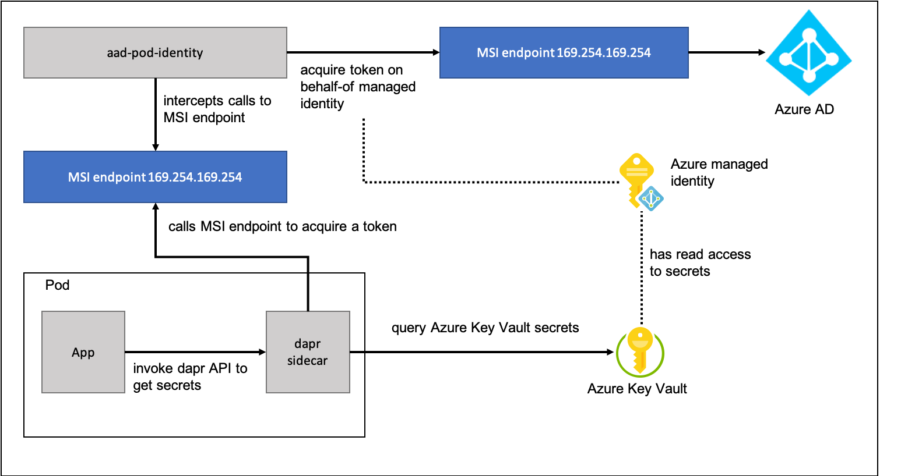

# Access Azure KeyVault using dapr secretstore and aad-pod-identity

In this article I want to show you how you can access secrets that are stored in Azure KeyVault using aad-pod-identity and dapr. Azure KeyVault allows you to store application secrets centralized and control their distribution. Azure Key Vault reduces the chances that secrets my be accidently leaked. When using Azure Key Vault, application developer no longer need to store secrets in the application or application configuration. 
For example, an application may need to connect to a database. Instead of storing the connection string in the app's code, you can store it securely in Key Vault. 
Application developer can access secrets using the Azure Key Vault's API providing a valid identity token. A token can be acquired using either Azure Managed identity or a service principal. 
Instead of managing an Azure AD's service principal I prefer using a managed identity. A managed identity for Azure resources is a feature of Azure Active Directory. With this feature you don't need to manage credentials anymore. If you want to get more insights about Azure managed identities have a look [here](https://docs.microsoft.com/en-us/azure/active-directory/managed-identities-azure-resources/overview). 
An Azure managed identity is an Azure resource that you can create within a resource group. You can assign RBAC roles to access Azure resources on behalf-of the managed identity. For example, you can assign get and list rights to allow a managed identity to access an Azure Key Vault's secrets. Within your code you can acquire a token on behalf-of the managed identity and access the Key Vault programmmatically. 
[Aad-pod-identity](https://github.com/Azure/aad-pod-identity) is a Kubernetes controller that allows you to assign an Azure managed identity to a Kubernetes pod or deployment. With this assignment it is possible within your application code to get a token by calling the Managed identity service endpoint. Dapr secretstore even go one step further. The dapr sidecar allows you to read secrets from an Azure Key Vault without acquiring a token. If you define a dapr secretstore component, dapr does invoke the managed identity service endpoint to acquire a token to access the Azure Key Vault. All you need to do is to specify the Key Vault's URI. 

```yaml
apiVersion: dapr.io/v1alpha1
kind: Component
metadata:
  name: azurekeyvault
spec:
  type: secretstores.azure.keyvault
  metadata:
  - name: vaultName
    value: mykeyvault.vault.azure.ne
```
The aad-pod-identity controller ensures that a managed identity can be assigned to your pod or deployment. It ensures that each call to the managed identity endpoint (MSI endpoint) is redirected to the aad-pod-identity's Node Managed Identity. Node Managed Identity is a daemon set deployed to the Kubernetes cluster. It forwards the request to the aad-pod-identity's Managed Identity Controller to query the managed identity to use for the pod or deployment and returns a token. All you need to do is to specify a Kubernetes resource that describes your managed identity to use and a binding to assign the identity to your pod or deployment.

__AzureIdentity__ resource:
```yaml
apiVersion: "aadpodidentity.k8s.io/v1"
kind: AzureIdentity
metadata:
  name: myidentityname
spec:
  type: 0
  resourceID: <managed identity's resource id>
  clientID: <managed identity's client id>
```

__AzureIdentityBinding__ resource:
```yaml
apiVersion: "aadpodidentity.k8s.io/v1"
kind: AzureIdentityBinding
metadata:
  name: myidentityname-binding
spec:
  azureIdentity: myidentityname
  selector: myidentityname
```

At the end, the only thing you need is to assign a deployment or pod to an AzureIdentity. The AzureIdentityBinding defines a selector that must be used as a label in the deployment or pod:

```yaml
apiVersion: v1
kind: Pod
metadata:
  name: demo
  labels:
    aadpodidbinding: myidentityname
```

## Demo scenario overview

In the demo scenario we deploy a simple application that returns secrets stored in an Azure KeyVault. We use an Azure managed identity that has read access to an Azure Key Vault instance and the instance is accessed on behalf-of the managed identity. As we don't want to acquire a token in our code, we use a dapr secretstore component and invoke the dapr sidecar container to query the Azure Key Vault. Acquiring a token is done by calling the managed identity service endpoint that is controlled by aad-pod-identity.



## Create a resource group

All resources are deployed to a resource group that we have to create first:

```Shell
az group create -n $RESOURCE_GROUP -l $RESOURCE_LOCATION
```

## Setup an AKS cluster

Before we can deploy the components to an AKS cluster we need to setup an AKS Cluster with --enabled-managed-identity. I want to show you aad-pod-identity and dapr secretsstore with an AKS cluster that uses a managed identity. An AKS cluster requires an identity to create additional resources like load balancer, public IP, etc. This identity can either be a managed identity or a service principal. If we use a managed identity, the identity will be created for you. As described above, using a managed identity is the better choice, because you don't have to manage the a service prinicpal which must be renewed to keep the cluster working. 

## Variables

Before we start, we need a set of variables:

```Shell
export SUBSCRIPTION_ID=<your subscription id>
export RESOURCE_GROUP=<your AKS resource group name>
export RESOURCE_LOCATION=<your azure region>
export IDENTITY_NAME=<your managed identity name>
export KEYVAULT_NAME=<your keyvault name>
export CLUSTER_NAME=<your AKS Cluster name>
```

Now, we can create the AKS cluster:

```
az aks create -n $CLUSTER_NAME -g $RESOURCE_GROUP --enable-managed-identity
```

When your cluster is created, check the managed cluster resource group. There is a managed identity named $CLUSTER_NAME-agentpool. 

## Create a managed identity

Next, we create a managed identity that is used to access an Azure Key Vault later:

```Shell
az identity create -g $RESOURCE_GROUP -n $IDENTITY_NAME --subscription $SUBSCRIPTION_ID
export IDENTITY_CLIENT_ID="$(az identity show -g $RESOURCE_GROUP -n $IDENTITY_NAME --subscription $SUBSCRIPTION_ID --query clientId -otsv)"
export IDENTITY_RESOURCE_ID="$(az identity show -g $RESOURCE_GROUP -n $IDENTITY_NAME --subscription $SUBSCRIPTION_ID --query id -otsv)"
export IDENTITY_OBJECT_ID="$(az ad sp show --id $IDENTITY_CLIENT_ID --query objectId -otsv)"
```

## Assign 'Managed Identity Operator' role to Kubernetes ServicePrincipal

Now we need to give the AKS Cluster's managed identity rights to operate on the created managed identity.
Do the following to get your principal id:

```Shell
export AKS_CLIENT_ID=$(az aks show -n $CLUSTER_NAME -g $RESOURCE_GROUP --query identityProfile.kubeletidentity.clientId -otsv)
```

After that we can assign the *Managed Identity Operator* role to the AKS Cluster's principal for the managed identity scope:

```Shell
az role assignment create --assignee $AKS_CLIENT_ID --role "Managed Identity Operator" --scope /subscriptions/$SUBSCRIPTION_ID/resourcegroups/$RESOURCE_GROUP/providers/Microsoft.ManagedIdentity/userAssignedIdentities/$IDENTITY_NAME
```

**Note:**
If you have an AKS Cluster with __managed identity enabled__ we need to assign the role *"Virtual Machine Contributor"* to the AKS Cluster's service principal. For AKS cluster, the cluster resource group refers to the resource group with a MC_ prefix, which contains all of the infrastructure resources associated with the cluster like VM/VMSS.

If you need further information about needed role assignments look at the aad-pod-identity's 
[documentation](https://github.com/Azure/aad-pod-identity/blob/master/docs/readmes/README.role-assignment.md) .

```Shell
export CLUSTER_RESOURCE_GROUP=<your MC_ AKS Cluster resource group name>
az role assignment create --role "Virtual Machine Contributor" --assignee $AKS_CLIENT_ID --scope /subscriptions/$SUBSCRIPTION_ID/resourcegroups/$CLUSTER_RESOURCE_GROUP
```

## Install aad-pod-identity using helm

Now everything is prepared to setup aad-pod-identity using helm. In this demo we create a namespace for the aad-pod-identity's operator and daemon set to separate them from our application:

Get admin credentials:

```shell
az aks get-credentials -n $CLUSTER_NAME -g $RESOURCE_GROUP
```

Create a namspace:
```
kubectl create namespace aad-pod-identity
```

Install aad-pod-identity:
```
helm repo add aad-pod-identity https://raw.githubusercontent.com/Azure/aad-pod-identity/master/charts
helm repo update
helm install aad-pod-identity aad-pod-identity/aad-pod-identity --namespace aad-pod-identity
```

## Deploy AzureIdentity and AzureIdentityBinding

The sample application is deployed in its own namespace. To request an access token to access Azure resources from a pod, we need to deploy two Kubernetes Resources.
__AzureIdentity__ is the resource to link to an existing Azure managed identity. To specify which managed identity a Pod should use to acquire an access token a selector that specifies the binding must be added to the pod. __AzureIdentityBinding__ defines the name of the selector and the binding to an __AzureIdentity__.

Open the files [keyvault-azure-identity.yaml](./deploy/keyvault-azure-identity.yaml) and [keyvault-azure-identitybinding.yaml](./deploy/keyvault-azure-identitybinding.yaml) located in the _deploy_ folder and replace the *$* marked values with your values.

Create a namespace for the demo application,

```Shell
kubectl create namespace dapr-secrets
```

and apply the yaml files:

```
kubectl apply -f keyvault-azure-identity.yaml -n dapr-secrets
kubectl apply -f keyvault-azure-identitybinding.yaml -n dapr-secrets
```

Aad-pod-identity provides a simple demo image to validate your setup. Open the file [validate-identity-pod.yaml](./deploy/validate-identity-pod.yaml),replace the *$* marked values with your values and deploy the pod.

``` Shell
kubectl apply -f validate-identity-pod.yaml -n dapr-secrets
```

Check and validate the output of the validation pod:

```Shell
kubectl logs demo -n dapr-secrets
```

**Note** 
As we use an Azure managed identity that can access an Azure Key Vault only, the demo image returns an error when it tries to list VMs:
```Text
level=error msg="failed list all vm compute.VirtualMachinesClient#List: Failure responding to request: StatusCode=403 -- Original Error: autorest/azure: Service returned an error. Status=403 Code=\"AuthorizationFailed\" Message=\"The client '<id>' with object id '<id>' does not have authorization to perform action 'Microsoft.Compute/virtualMachines/read' over scope '/subscriptions/<subscription id>/resourceGroups/$RESOURCE_GROUP/providers/Microsoft.Compute' or the scope is invalid. If access was recently granted, please refresh your credentials.\"" podip=<pod ip> podname=demo podnamespace=demo
```
Please check the logs if a token was acquired sucessfully:
```Text
level=info msg="succesfully acquired a token using the MSI, msiEndpoint(http://169.254.169.254/metadata/identity/oauth2/token)" podip=<pod ip> podname=demo podnamespace=demo
level=info msg="succesfully acquired a token, userAssignedID MSI, msiEndpoint(http://169.254.169.254/metadata/identity/oauth2/token) clientID(<client id>)" podip=<pod ip> podname=demo podnamespace=demo
```

## Create an Azure key vault

Create an Azure key vault instance in your resource group and assign needed policies to get and list secrets on behalf-of the managed identity:

```Shell
az keyvault create --name $KEYVAULT_NAME --resource-group $RESOURCE_GROUP
az keyvault set-policy --name $KEYVAULT_NAME --resource-group $RESOURCE_GROUP --secret-permissions get list --object-id $IDENTITY_OBJECT_ID
```

Add two secrets to the key vault:

```Shell
az keyvault secret set --vault-name $KEYVAULT_NAME  --name secretone --value valueone
az keyvault secret set --vault-name $KEYVAULT_NAME  --name secrettwo --value valuetwo
```

## Install dapr

Now it's time to install dapr. We deploy the dapr runtime into its own namespace using helm.

```Shell
kubectl create namespace dapr-system
```

Add Azure Container Registry as a helm repo:

```Shell
helm repo add dapr https://daprio.azurecr.io/helm/v1/repo
helm repo update
```

Install dapr:

```Shell
helm install dapr dapr/dapr --namespace dapr-system
```

Once the chart installation is done, verify the Dapr operator pods are running in the dapr-system namespace:

```Shell
kubectl get pods --namespace dapr-system
```

## Deploy the sample application

To let dapr know which Azure key vault is used, a dapr secretstore component must be deployed.

```yaml
apiVersion: dapr.io/v1alpha1
kind: Component
metadata:
  name: azurekeyvault
spec:
  type: secretstores.azure.keyvault
  metadata:
  - name: vaultName
    value: $KEYVAULT_NAME
```

As we use aad-pod-identity the dapr sidecar will use the MSI endpoint to acquire a token to access the Azure key vault.
In the previous steps we have created a managed identity which has read access to the Azure key vault instance. With __AzureIdentity__ and __AzureIdentityBinding__ we can bind a deployment to a managed identity that is used to acquire a token.

```yaml
apiVersion: apps/v1
kind: Deployment
metadata:
  name: api-aspnetcore
  labels:
    app: dapr-secrets
spec:
  replicas: 1
  selector:
    matchLabels:
      app: dapr-secrets
  template:
    metadata:
      labels:
        app: dapr-secrets
        aadpodidbinding: $IDENTITY_NAME
      annotations:
        dapr.io/enabled: "true"
        dapr.io/id: "api-aspnetcore"
        dapr.io/port: "5000"
    spec:
      containers:
        - name: api-aspnetcore
          image: m009/dapr-secret-api-dotnetcore:0.1
          ports:
            - containerPort: 5000
          imagePullPolicy: Always
```

Open the [dapr-azure-keyvault-secretstore component file](./deploy/dapr-azure-keyvault-secretstore.yaml) replace the $ marked value and deploy it to your cluster:

```
kubectl apply -f dapr-azure-keyvault-secretstore.yaml -n dapr-secrets
```

Open the [api-aspnetcore-deployment file ](./deploy/api-aspnetcore-deployment.yaml) replace the $ marked value and deploy it to your cluster:

```Shell
kubectl apply -f api-aspnetcore-deployment.yaml -n dapr-secrets
```

After that deploy the [dapr-secrets-service file](./deploy/dapr-secrets-service.yaml) and get the public ip:

```Shell
kubectl apply -f dapr-secrets-service.yaml -n dapr-secrets
kubectl get service -n dapr-secrets
```

## Test the demo application

After you have the public ip of the demo application's service, open your brwoser and naviagte http://<ip>/secret. You should see the following output:

```JSON
SecretOne: {"secretone":"valueone"} | SecretTwo: {"secrettwo":"valuetwo"}
```

## Investigate the source code

The demo application simply invokes the dapr sidecar to query one secret after the other and returns the values.
The dapr sidecar is listening on port 3500 and the secrets are read by specifying the following url:

```Text
http://localhost:{_daprPort}/v1.0/secrets/{_secretStoreName}/{_secretName}
```
The path parameter _secretStoreName is the name of the dapr secretstore that is specified in [dapr-azure-keyvault-secretstore](./deploy/dapr-azure-keyvault-secretstore.yaml). The path parameter _secretName is the name of the secret that is read from the Azure key vault instance.

```C#
    public class SecretController : ControllerBase
    {
        private static int _daprPort = 3500;
        private static string _secretsUrl = $"http://localhost:{_daprPort}/v1.0/secrets";
        private static string _secretStoreName = "azurekeyvault";
        private static string _secretOne = "secretone";
        private static string _secretTwo = "secrettwo";

        [HttpGet]
        public async Task<IActionResult> GetSecrets()
        {
            try
            {
                var client = new HttpClient();
                var result = await client.GetAsync($"{_secretsUrl}/{_secretStoreName}/{_secretOne}");

                if (!result.IsSuccessStatusCode)
                {
                    return StatusCode((int)HttpStatusCode.InternalServerError);
                }

                var secretOne = await result.Content.ReadAsStringAsync();

                result = await client.GetAsync($"{_secretsUrl}/{_secretStoreName}/{_secretTwo}");

                if (!result.IsSuccessStatusCode)
                {
                    return StatusCode((int)HttpStatusCode.InternalServerError);
                }

                var secretTwo = await result.Content.ReadAsStringAsync();

                return Ok($"SecretOne: {secretOne} | SecretTwo: {secretTwo}");
            }
            catch (Exception ex)
            {
                return Ok(ex.Message);
            }
        }
    }
```