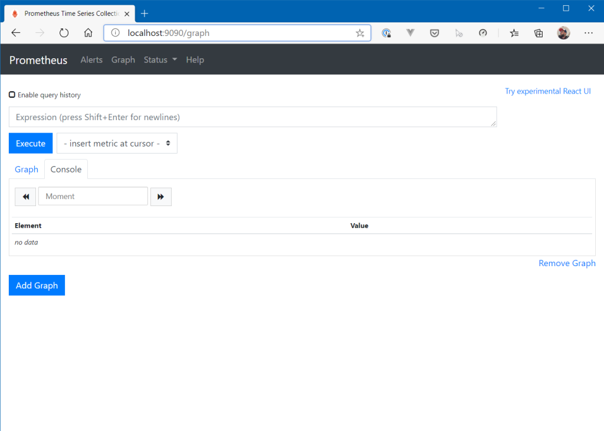

## Introduction

This article will show you how to scale a deployment (NodeJS / Express app) based on a custom metric which is collected by Prometheus. 

## How does it work?

To be able to work with custom metrics as a basis for scaling deployments (or e.g. stateful sets), various requirements must be met. 

You need an application that provides the appropriate metrics **(the metrics source)**. In addition, you need a service that is able to query the metrics from the application at certain intervals **(the metrics collector)**. To make a metric available to the Horizontal Pod Autoscaler, it must first be added to a **Metrics Registry**. And last but not least, a **custom metrics API** must provide access to the metric for the Horizontal Pod Autoscaler.

To give you the complete view of what’s possible…here’s the list of available metric types:

- Resource metrics (predefined metrics like CPU)
- Custom metrics (associated with a Kubernetes object)
- External metrics (coming from external sources like e.g. RabbitMQ, Azure Service Bus etc.)


## Sample

Install/add the following to your cluster:

- application (deployment) that exposes a custom metric
- Prometheus (incl. Grafana to have some nice charts) and a Prometheus Service Monitor to scrape the metrics endpoint of the application
- Prometheus Adapter which is able to provide a Prometheus metric for the custom metrics API
- Horizontal Pod Autoscaler definition that references the custom metric

### Prometheus

To install Prometheus, use “kube-prometheus” ([https://github.com/coreos/kube-prometheus](https://github.com/coreos/kube-prometheus)) which installs Prometheus as well as Grafana (and Alertmanager etc.)! 

Clone the project to your local machine and deploy it to your cluster:

```shell
# from within the cloned repo...
 
$ kubectl apply -f manifests/setup
$ kubectl apply -f manifests/
```

Wait a few seconds until everything is installed and then check access to the Prometheus Web UI and Grafana (by port-forwarding the services to your local machine):

```shell
$ kubectl --namespace monitoring port-forward svc/prometheus-k8s 9090
Forwarding from 127.0.0.1:9090 -> 9090
Forwarding from [::1]:9090 -> 9090
```



Check the same for Grafana (if you are promted for a username and password, default is: “admin”/”admin” – you need to change that on the first login):

```shell
$ kubectl --namespace monitoring port-forward svc/grafana 3000
Forwarding from 127.0.0.1:3000 -> 3000
Forwarding from [::1]:3000 -> 3000
```

<figcaption>Grafana</figcaption>


### Metrics Source / Sample Application

To demonstrate how to work with custom metrics, here is a **very** basic NodeJS application that provides a single endpoint. If requests are sent to this endpoint, a counter (Prometheus Gauge) is set with a value provided from the body of the request. The application itself uses the Express framework and an additional library that allows to “interact” with Prometheus (prom-client) – to provide metrics via a _/metrics_ endpoint.

```javascript
const express = require("express");
const os = require("os");
const app = express();
const apiMetrics = require("prometheus-api-metrics");
app.use(apiMetrics());
app.use(express.json());
 
const client = require("prom-client");
 
// Create Prometheus Gauge metric
const gauge = new client.Gauge({
  name: "custom_metric_counter_total_by_pod",
  help: "Custom metric: Count per Pod",
  labelNames: ["pod"],
});
 
app.post("/api/count", (req, res) => {
  // Set metric to count value...and label to "pod name" (hostname)
  gauge.set({ pod: os.hostname }, req.body.count);
  res.status(200).send("Counter at: " + req.body.count);
});
 
app.listen(4000, () => {
  console.log("Server is running on port 4000");
  // initialize gauge
  gauge.set({ pod: os.hostname }, 1);
});
```

As you can see, a “Gauge” metric is created – which is one of the types, Prometheus supports. Here’s a list of what metrics are offered (description from the official documentation):

- **Counter** – a cumulative metric that represents a single monotonically increasing counter whose value can only increase or be reset to zero on restart
- **Gauge** – a gauge is a metric that represents a single numerical value that can arbitrarily go up and down
- **Histogram** – a histogram samples observations (usually things like request durations or response sizes) and counts them in configurable buckets. It also provides a sum of all observed values.
- **Summary** – Similar to a _histogram_, a _summary_ samples observations (usually things like request durations and response sizes). While it also provides a total count of observations and a sum of all observed values, it calculates configurable quantiles over a sliding time window.

To learn more about the metrics types and when to use what, see the [official Prometheus documentation](https://prometheus.io/docs/concepts/metric_types/).

Now deploy the application (plus a service for it) with the following YAML manifest:

```yaml
apiVersion: apps/v1 
kind: Deployment
metadata:
  name: promdemo 
  labels:
    application: promtest
    service: api
spec:
  replicas: 1
  strategy:
    type: RollingUpdate
    rollingUpdate:
      maxSurge: 1
      maxUnavailable: 1
  minReadySeconds: 5
  revisionHistoryLimit: 3
  selector:
    matchLabels:
      application: promtest
      service: api
  template:
    metadata:
      labels:
        application: promtest
        service: api
    spec:
      automountServiceAccountToken: false
      containers:
        - name: application
          resources:
            requests:
              memory: "64Mi"
              cpu: "100m"
            limits:
              memory: "256Mi"
              cpu: "500m"
          image: csaocpger/expressmonitoring:4.3
          imagePullPolicy: IfNotPresent
          ports:
          - containerPort: 4000
---
apiVersion: v1
kind: Service
metadata:
  name: promdemo
  labels:
    application: promtest
spec:
  ports:
  - name: http
    port: 4000
    targetPort: 4000
  selector:
    application: promtest
    service: api
  type: LoadBalancer
```

Next, we need to tell Prometheus to scrape the _/metrics_ endpoint (this endpoint is automatically created by one of the libraries used in the app). Therefore, install a _ServiceMonitor_ which is a custom resource definition from Prometheus, pointing to “a source of metrics”.

```yaml
kind: ServiceMonitor
apiVersion: monitoring.coreos.com/v1
metadata:
  name: promtest
  labels:
    application: promtest
spec:
  selector:
    matchLabels:
      application: promtest
  endpoints: 
  - port: http
```

What that basically does, is telling Prometheus to look for a service called “promtest” and scrape the metrics via the (default) endpoint _/metrics_ on the _http_ port (which is set to port 4000 in the Kubernetes service).

The _/metrics_ endpoint reports values like that:

```shell
$ curl --location --request GET 'http://<EXTERNAL_IP_OF_SERVICE>:4000/metrics' | grep custom_metric
  % Total    % Received % Xferd  Average Speed   Time    Time     Time  Current
                                 Dload  Upload   Total   Spent    Left  Speed
100 26337  100 26337    0     0   325k      0 --:--:-- --:--:-- --:--:--  329k
# HELP custom_metric_counter_total_by_pod Custom metric: Count per Pod
# TYPE custom_metric_counter_total_by_pod gauge
custom_metric_counter_total_by_pod{pod="promdemo-56946cb44-d5846"} 1
```

When the _ServiceMonitor_ has been applied, Prometheus will be able to discover the pods/endpoints behind the service and pull the corresponding metrics. In the web UI, you should be able to see the following “scrape target”:


Let's test the environment. Open Grafana and have a look at the Custom dashboard (you can import it via the JSON file *hpa-custom-metrics/grafana_dashboard.json* in this GitHub repo). You see, there is one pod running in the cluster reporting a value of “1” at the moment.


If everything works correctly, the service can now be called on _/api/count_ to set the custom metric via a POST request with a JSON document that looks like that:

```json
{
    "count": 7
}
```

So, let’s try this out…

```shell
$ curl --location --request POST 'http://<EXTERNAL_IP_OF_SERVICE>:4000/api/count' \
--header 'Content-Type: application/json' \
--data-raw '{
    "count": 7
}'
```


This works as expected. After setting the value via a POST request to “7”, Prometheus receives the updated value by scraping the metrics endpoint and Grafana is able to show the updated chart. To be able to execute the full example in the end on the basis of a “clean environment”, we set the counter back to “1”.

```shell
$ curl --location --request POST 'http://<EXTERNAL_IP_OF_SERVICE>:4000/api/count' \
--header 'Content-Type: application/json' \
--data-raw '{
    "count": 1
}'
```

From a monitoring point of view, all the neccessary work has been done. 

### Prometheus Adapter

Now, the adapter must be installed. There exist several adpaters for Prometheus, in this sample we use: [https://github.com/DirectXMan12/k8s-prometheus-adapter](https://github.com/DirectXMan12/k8s-prometheus-adapter)

First, clone the repository and change the **URL for the Prometheus server** in the file _k8s-prometheus-adapter/deploy/manifests/custom-metrics-apiserver-deployment.yaml_ (sample can be found here: **hpa-custom-metrics/k8s-prom-adapter-files/custom-metrics-apiserver-deployment.yaml**). In the current case, this is [_http://prometheus-k8s.monitoring.svc:9090/_](http://prometheus-k8s.monitoring.svc:9090/).

Now, an additional mapping rule for the custom metric must be defined in the ConfigMap, which defines the rules for mapping from Prometheus metrics to the Metrics API schema (_k8s-prometheus-adapter/deploy/manifests/custom-metrics-config-map.yaml_, sample here: **hpa-custom-metrics/k8s-prom-adapter-files/custom-metrics-config-map.yaml**). This rule looks like this:

```yaml
- seriesQuery: 'custom_metric_counter_total_by_pod{namespace!="",pod!=""}'
      seriesFilters: []
      resources:
        overrides:
          namespace:
            resource: namespace
          pod:
            resource: pod
      name:
        matches: "^(.*)_total_by_pod"
        as: "${1}"
      metricsQuery: sum(<<.Series>>{<<.LabelMatchers>>})
```

If you want to find out more about how the mapping works, please have a look at the [official documentation](https://github.com/DirectXMan12/k8s-prometheus-adapter/blob/master/docs/config-walkthrough.md). In this case, the query for _custom\_metric\_counter\_total\_by\_pod_ is executed and the results are mapped to the metrics schema as total/sum values.

To enable the adapter to function as a custom metrics API in the cluster, a SSL certificate must be created that can be used by the Prometheus adapter. All traffic from the Kubernetes control plane components to each other must be secured by SSL. This SSL certificate must be added upfront as a secret in the cluster, so that the Custom Metrics Server can automatically map it as a volume during deployment.

The _gencerts_._sh_ script does all the heavy-lifting for you (you will need Go 1.12+ on your machine!). The result of the script is a file called _cm-adapter-serving-certs.yaml_ containing the certificate. Please add that secret to the cluster before installing the adpater. To whole process looks like this (in the folder of the git clone):

```shell
$ ./gencerts.sh
$ kubectl create namespace custom-metrics
$ kubectl apply -f cm-adapter-serving-certs.yaml -n custom-metrics
$ kubectl apply -f manifests/
```

As soon as the installation is completed, open a terminal and query the custom metrics API for our metric called _custom\_metric\_counter\_total\_by\_pod_ via kubectl. If everything is set up correctly, you should be able to get a result from the metrics server like that:

```shell
$ kubectl get --raw="/apis/custom.metrics.k8s.io/v1beta1/namespaces/default/pods/*/custom_metric_counter_total_by_pod?pod=$(kubectl get po -o name)" | jq
 
{
  "kind": "MetricValueList",
  "apiVersion": "custom.metrics.k8s.io/v1beta1",
  "metadata": {
    "selfLink": "/apis/custom.metrics.k8s.io/v1beta1/namespaces/default/pods/%2A/custom_metric_counter_total_by_pod"
  },
  "items": [
    {
      "describedObject": {
        "kind": "Pod",
        "namespace": "default",
        "name": "promdemo-56946cb44-d5846",
        "apiVersion": "/v1"
      },
      "metricName": "custom_metric_counter_total_by_pod",
      "timestamp": "2020-05-26T12:22:15Z",
      "value": "1",
      "selector": null
    }
  ]
}
```

The Custom Metrics API returns a result for our custom metric – stating that the current value is “1”.

### Horizontal Pod Autoscaler

Now we need to deploy a Horizontal Pod Autoscaler that targets our app deployment and references the custom metric _custom\_metric\_counter\_total\_by\_pod_ as a metrics source:

```yaml
kind: HorizontalPodAutoscaler
apiVersion: autoscaling/v2beta1
metadata:
  name: prometheus-demo-app
spec:
  scaleTargetRef:
    apiVersion: apps/v1
    kind: Deployment
    name: promdemo
  minReplicas: 1
  maxReplicas: 10
  metrics:
  - type: Pods
    pods:
      metricName: custom_metric_counter_total_by_pod
      targetAverageValue: "3"
```

Everything is in place now and we can make a new request against the API to increase the value of the counter back to “7”. 

Please keep in mind that the target value for the HPA was “3”. This means that the Horizotal Pod Autoscaler should scale our deployment to a total of three pods after a short amount of time.

```shell
$ curl --location --request POST 'http://<EXTERNAL_IP_OF_SERVICE>:4000/api/count' \
--header 'Content-Type: application/json' \
--data-raw '{
    "count": 7
}'
```

How does the Grafana Dashboard look like after that request?


Also, the Custom Metrics API reports a new value:

```shell
$ kubectl get --raw="/apis/custom.metrics.k8s.io/v1beta1/namespaces/default/pods/*/custom_metric_counter_total_by_pod?pod=$(kubectl get po -o name)" | jq
 
{
  "kind": "MetricValueList",
  "apiVersion": "custom.metrics.k8s.io/v1beta1",
  "metadata": {
    "selfLink": "/apis/custom.metrics.k8s.io/v1beta1/namespaces/default/pods/%2A/custom_metric_counter_total_by_pod"
  },
  "items": [
    {
      "describedObject": {
        "kind": "Pod",
        "namespace": "default",
        "name": "promdemo-56946cb44-d5846",
        "apiVersion": "/v1"
      },
      "metricName": "custom_metric_counter_total_by_pod",
      "timestamp": "2020-05-26T12:38:58Z",
      "value": "7",
      "selector": null
    }
  ]
}
```

Last but not least, the Horizontal Pod Autoscaler does its job and scales the deployment the three pods!

```shell
$ kubectl get events
LAST SEEN   TYPE     REASON              OBJECT                                        MESSAGE
 
118s        Normal   ScalingReplicaSet   deployment/promdemo                           Scaled up replica set promdemo-56946cb44 to 3
118s        Normal   SuccessfulRescale   horizontalpodautoscaler/prometheus-demo-app   New size: 3; reason: pods metric custom_metric_counter_total_by_pod above target
```


## Wrap-Up

So what did we see in this example? We first installed **Prometheus** with the appropriate addons like **Grafana** , Alert Manager (which we did not use in this example…). Then we added a **custom metric** to an application and used Prometheus **scraping** to retrieve it, so that it was available for evaluation within Prometheus. The next step was to install the **Prometheus adapter**. Finally, we created an Horizontal Pod Autoscaler in the cluster that used the custom metric to scale the pods of our deployment.