# Azure DevOps Terraform Provider

Not too long ago, the first version of the Azure DevOps Terraform Provider was released. In this article I will show you with several examples which features are currently supported in terms of build pipelines and how to use the provider - also in conjunction with Azure. The provider is the last "building block" for many people working in the "Infrastructure As Code" space to create environments (including Git Repos, service connections, build + release pipelines etc.) completely automatically.

The provider was released in June 2020 in version _0.0.1_, but to be honest: the feature set is quite rich already at this early stage.

The features I would like to discuss with the help of examples are as follows:

- Create a DevOps project including a hosted Git repo.
- Creation of a build pipeline
- Usage of variables and variable groups
- Creating an Azure service connection and using variables/secrets from an Azure KeyVault

## Example 1: Basic Usage

The Azure DevOps provider can be integrated in a script like any other Terraform provider. All that's required is the URL to the DevOps organisation and a Personal Access Token (PAT) with which the provider can authenticate itself against Azure DevOps.

The PAT itself can be easily created via the UI of Azure DevOps by creating a new token via ```User Settings --> Personal Access Token --> New Token```. For the sake of simplicity, in this example I give "Full Access" to it - of course this should be adapted for your own purposes.

> The documentation of the Terraform Provider contains information about the permissions needed for the respective resource.

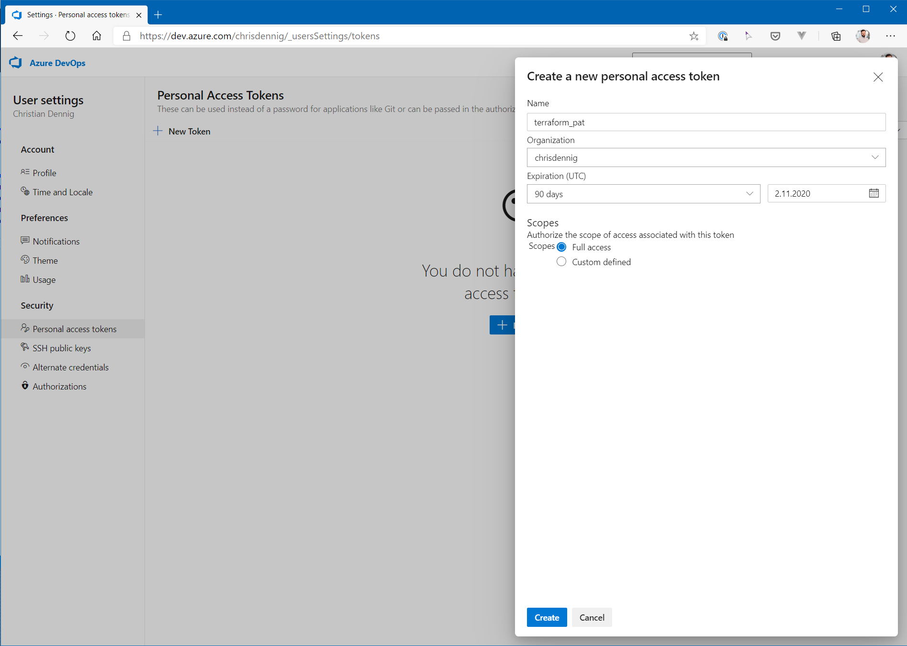

Once the access token has been created, the Azure DevOps provider can be referenced in the terraform script as follows:

```hcl
provider "azuredevops" {
  version               = ">= 0.0.1"
  org_service_url       = var.orgurl
  personal_access_token = var.pat
}
```

The two variables ```orgurl``` and ```pat``` should be exposed as environment variables:

```shell
$ export TF_VAR_orgurl = "https://dev.azure.com/<ORG_NAME>"
$ export TF_VAR_pat = "<PAT_AUS_AZDEVOPS>"
```

This has formed the basis for working with Terraform against Azure DevOps. So let's create a new project and a git repository. Two resources are needed for this, [azuredevops_project](https://www.terraform.io/docs/providers/azuredevops/r/project.html) and [azuredevops_git_repository](https://www.terraform.io/docs/providers/azuredevops/r/azure_git_repository.html):

```hcl
resource "azuredevops_project" "project" {
  project_name       = "Terraform DevOps Project"
  description        = "Sample project to demonstrate AzDevOps <-> Terraform integragtion"
  visibility         = "private"
  version_control    = "Git"
  work_item_template = "Agile"
}

resource "azuredevops_git_repository" "repo" {
  project_id = azuredevops_project.project.id
  name       = "Sample Empty Git Repository"

  initialization {
    init_type = "Clean"
  }
}
```

Additionally, we also need an initial pipeline that will be triggered on a git push to ```master```.
In a pipeline, you usually work with variables that come from different sources. These can be pipeline variables, values from a variable group or from external sources such as an Azure KeyVault. The first, simple build definition uses pipeline variables (```mypipelinevar```):

```hcl
resource "azuredevops_build_definition" "build" {
  project_id = azuredevops_project.project.id
  name       = "Sample Build Pipeline"

  ci_trigger {
    use_yaml = true
  }

  repository {
    repo_type   = "TfsGit"
    repo_id     = azuredevops_git_repository.repo.id
    branch_name = azuredevops_git_repository.repo.default_branch
    yml_path    = "azure-pipeline.yaml"
  }

  variable {
    name      = "mypipelinevar"
    value     = "Hello From Az DevOps Pipeline!"
    is_secret = false
  }
}
```

The corresponding pipeline definition looks as follows:

```yaml
trigger:
- master

pool:
  vmImage: 'ubuntu-latest'

steps:
- script: echo Hello, world!
  displayName: 'Run a one-line script'

- script: |
    echo Pipeline is running!
    echo And here is the value of our pipeline variable
    echo $(mypipelinevar)
  displayName: 'Run a multi-line script'
```

The pipeline just executes some scripts - for demo purposes - and outputs the variable **stored in the definition to the console**.

Running the Terraform script, it creates an Azure DevOps project, a git repository and a build definition.

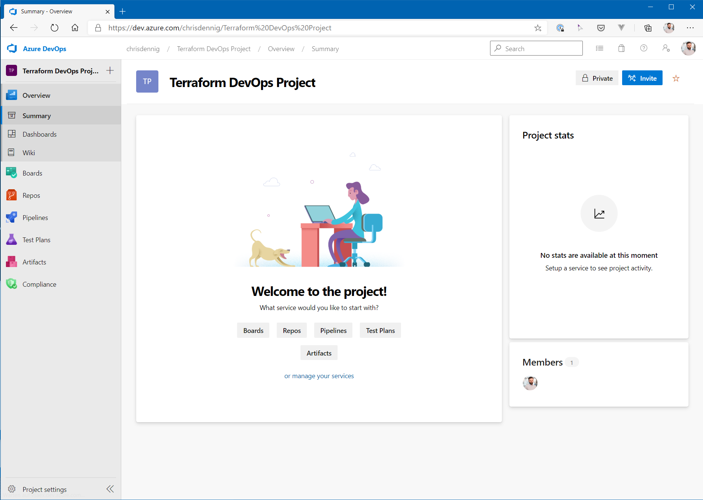

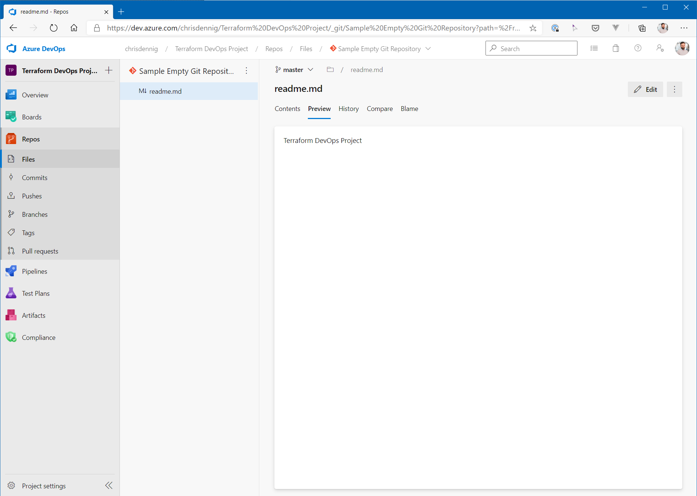

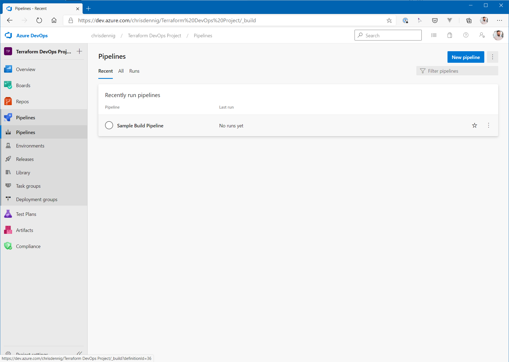

If the file ```azure_pipeline.yaml``` discussed above is pushed into the repo, the corresponding pipeline is triggered and the results can be found in the respective build step:

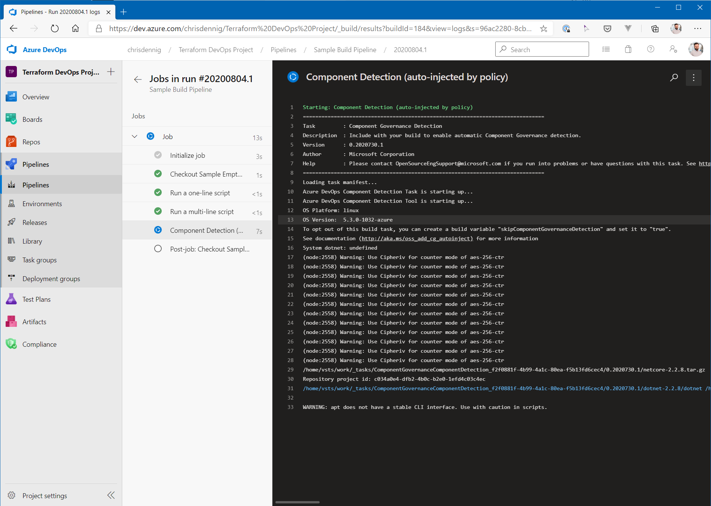

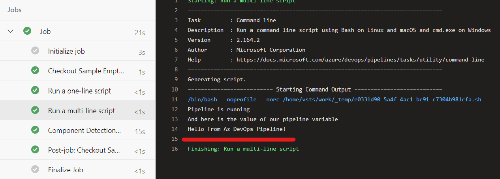

## Example 2: Using variable groups

Normally, variables are not directly stored in a pipeline definition, but rather put into [Azure DevOps variable groups](https://docs.microsoft.com/en-us/azure/devops/pipelines/library/variable-groups?view=azure-devops&tabs=yaml). This allows you to store individual variables centrally in Azure DevOps and then reference and use them in different pipelines.

Fortunately, variable groups can also be created using Terraform. For this purpose, the resource [azuredevops_variable_group](https://www.terraform.io/docs/providers/azuredevops/r/variable_group.html) is used. In our script this looks like this:

```hcl
resource "azuredevops_variable_group" "vars" {
  project_id   = azuredevops_project.project.id
  name         = "my-variable-group"
  allow_access = true

  variable {
    name  = "var1"
    value = "value1"
  }

  variable {
    name  = "var2"
    value = "value2"
  }
}

resource "azuredevops_build_definition" "buildwithgroup" {
  project_id = azuredevops_project.project.id
  name       = "Sample Build Pipeline with VarGroup"

  ci_trigger {
    use_yaml = true
  }

  variable_groups = [
    azuredevops_variable_group.vars.id
  ]

  repository {
    repo_type   = "TfsGit"
    repo_id     = azuredevops_git_repository.repo.id
    branch_name = azuredevops_git_repository.repo.default_branch
    yml_path    = "azure-pipeline-with-vargroup.yaml"
  }

}
```

The first part of the terraform script creates the variable group in Azure DevOps (name: ```my-variable-group```) including two variables (```var1``` and ```var2```), the second part - a build definition - uses the variable group, so that the variables can be accessed in the corresponding pipeline file (```azure-pipeline-with-vargroup.yaml```).

It has the following content:

```yaml
trigger:
- master

pool:
  vmImage: 'ubuntu-latest'

variables:
- group: my-variable-group

steps:
- script: echo Hello, world!
  displayName: 'Run a one-line script'

- script: |
    echo Var1: $(var1)
    echo Var2: $(var2)
  displayName: 'Run a multi-line script'
```

If you run the Terraform script, the corresponding Azure DevOps resources will be created: a variable group and a pipeline.

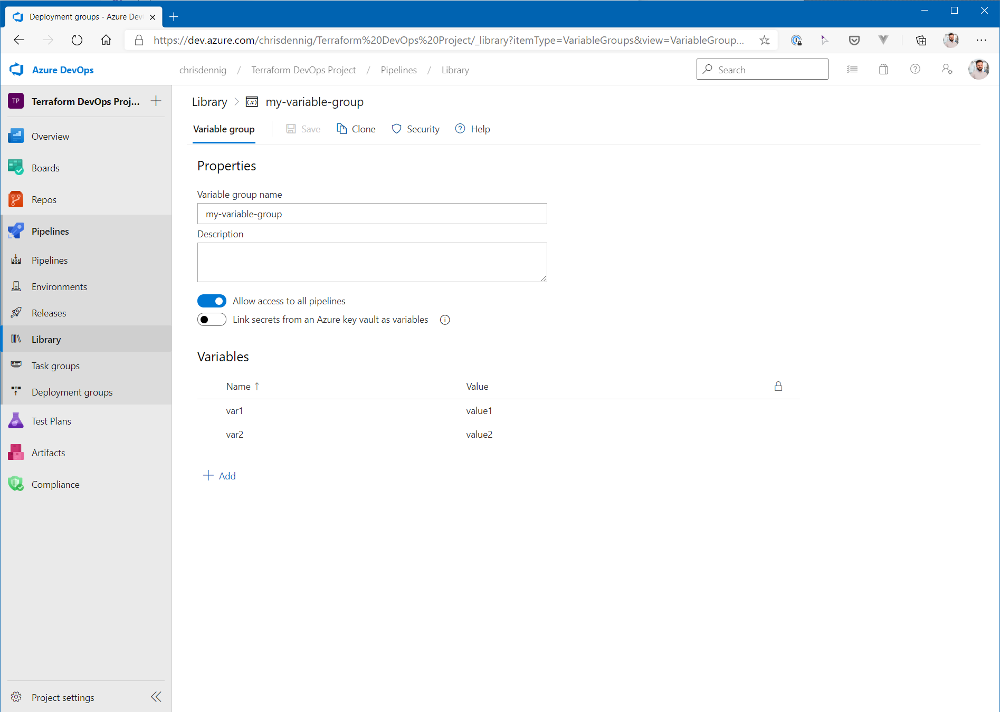

If you pusht the build YAML file to the repo, the pipeline will be executed and you should see the values of the two variables as output on the build console.

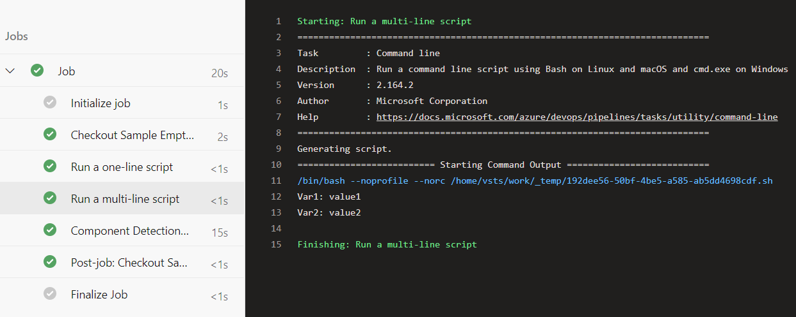

## Example 3: Using an Azure KeyVault and Azure DevOps Service Connections

For security reasons, critical values are neither stored directly in a pipeline definition nor in Azure DevOps variable groups. You would normally use an external vault like _Azure KeyVault_. Fortunately, with Azure DevOps you have the possibility to access an existing Azure KeyVault directly and access secrets which are then made available as variables within your build pipeline.

Of course, Azure DevOps must be authenticated/authorized against Azure for this. Azure DevOps uses the concept of [service connections](https://docs.microsoft.com/en-us/azure/devops/pipelines/library/service-endpoints?view=azure-devops&tabs=yaml) for this purpose. Service connections are used to access e.g. Bitbucket, GitHub, Jira, Jenkis...or - as in our case - Azure. You define a user - for Azure this is a _service principal_ - which is used by DevOps pipelines to perform various tasks - in our example fetching a secret from a KeyVault.

To demonstrate this scenario, various things must first be set up on Azure:

- Creating an application / service principal in the Azure Active Directory, which is used by Azure DevOps for authentication
- Creation of an Azure KeyVault (including a resource group)
- Authorizing the service principal to the Azure KeyVault to be able to read ``secrets`` (no write access!)
- Creating a secret that will be used in a variable group / pipeline

With the [Azure Provider](https://www.terraform.io/docs/providers/azurerm/index.html), Terraform offers the possibility to manage Azure services. We will be using it to create the resources mentioned above.

### AAD Application + Service Principal

First of all, we need a service principal that can be used by Azure DevOps to authenticate against Azure. The corresponding Terraform script looks like this:

```hcl
data "azurerm_client_config" "current" {
}

provider "azurerm" {
  version = "~> 2.6.0"
  features {
    key_vault {
      purge_soft_delete_on_destroy = true
    }
  }
}

## Service Principal for DevOps

resource "azuread_application" "azdevopssp" {
  name = "azdevopsterraform"
}

resource "random_string" "password" {
  length  = 24
}

resource "azuread_service_principal" "azdevopssp" {
  application_id = azuread_application.azdevopssp.application_id
}

resource "azuread_service_principal_password" "azdevopssp" {
  service_principal_id = azuread_service_principal.azdevopssp.id
  value                = random_string.password.result
  end_date             = "2024-12-31T00:00:00Z"
}

resource "azurerm_role_assignment" "contributor" {
  principal_id         = azuread_service_principal.azdevopssp.id
  scope                = "/subscriptions/${data.azurerm_client_config.current.subscription_id}"
  role_definition_name = "Contributor"
}
```

With the script shown above, both an AAD Application and a service principal are generated. Please note that the service principal is assigned the role ```Contributor``` - on subscription level, see ```scope``` assignment. This should be restricted accordingly in your own projects (e.g. to the respective resource group)!

### Azure KeyVault

The KeyVault is created the same way as the previous resources. It is important to note that the user working against Azure is given full access to the secrets in the KeyVault. Further down in the script, the permissions for the Azure DevOps service principal are also granted within the KeyVault - but in that case only **read permissions**! Last but not least, a corresponding secret called ```kvmysupersecretsecret``` is created, which we can use to test the integration.

```hcl
resource "azurerm_resource_group" "rg" {
  name     = "myazdevops-rg"
  location = "westeurope"
}

resource "azurerm_key_vault" "keyvault" {
  name                        = "myazdevopskv"
  location                    = "westeurope"
  resource_group_name         = azurerm_resource_group.rg.name
  enabled_for_disk_encryption = true
  tenant_id                   = data.azurerm_client_config.current.tenant_id
  soft_delete_enabled         = true
  purge_protection_enabled    = false

  sku_name = "standard"

  access_policy {
    tenant_id = data.azurerm_client_config.current.tenant_id
    object_id = data.azurerm_client_config.current.object_id

    secret_permissions = [
      "backup",
      "get",
      "list",
      "purge",
      "recover",
      "restore",
      "set",
      "delete",
    ]
    certificate_permissions = [
    ]
    key_permissions = [
    ]
  }

}

## Grant DevOps SP permissions

resource "azurerm_key_vault_access_policy" "azdevopssp" {
  key_vault_id = azurerm_key_vault.keyvault.id

  tenant_id = data.azurerm_client_config.current.tenant_id
  object_id = azuread_service_principal.azdevopssp.object_id

  secret_permissions = [
    "get",
    "list",
  ]
}

## Create a secret

resource "azurerm_key_vault_secret" "mysecret" {
  key_vault_id = azurerm_key_vault.keyvault.id
  name         = "kvmysupersecretsecret"
  value        = "KeyVault for the Win!"
}
```

If you have followed the steps described above, the result in Azure is a newly created KeyVault containing a secret:

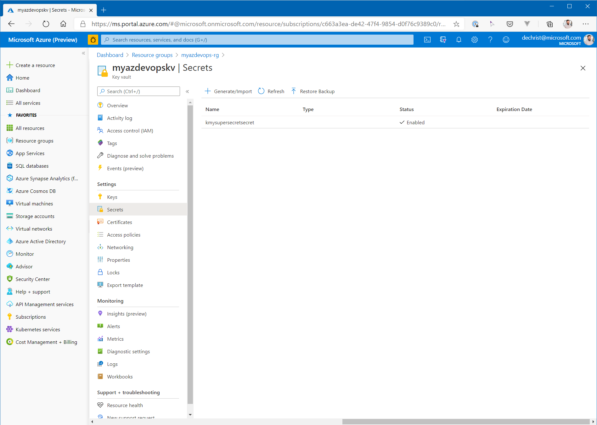

### Service Connection

Now, we need the integration into Azure DevOps, because we finally want to access the newly created secret in a pipeline. Azure DevOps is "by nature" able to access a KeyVault and the secrets it contains. To do this, however, you have to perform some manual steps - when not using Terraform - to enable access to Azure. Fortunately, these can now be automated with Terraform. The following resources are used to create a service connection to Azure in Azure DevOps and to grant access to our project:

```hcl
## Service Connection

resource "azuredevops_serviceendpoint_azurerm" "endpointazure" {
  project_id            = azuredevops_project.project.id
  service_endpoint_name = "AzureRMConnection"
  credentials {
    serviceprincipalid  = azuread_service_principal.azdevopssp.application_id
    serviceprincipalkey = random_string.password.result
  }
  azurerm_spn_tenantid      = data.azurerm_client_config.current.tenant_id
  azurerm_subscription_id   = data.azurerm_client_config.current.subscription_id
  azurerm_subscription_name = "dechrist - Microsoft Azure Internal Consumption"
}

## Grant permission to use service connection

resource "azuredevops_resource_authorization" "auth" {
  project_id  = azuredevops_project.project.id
  resource_id = azuredevops_serviceendpoint_azurerm.endpointazure.id
  authorized  = true 
}
```

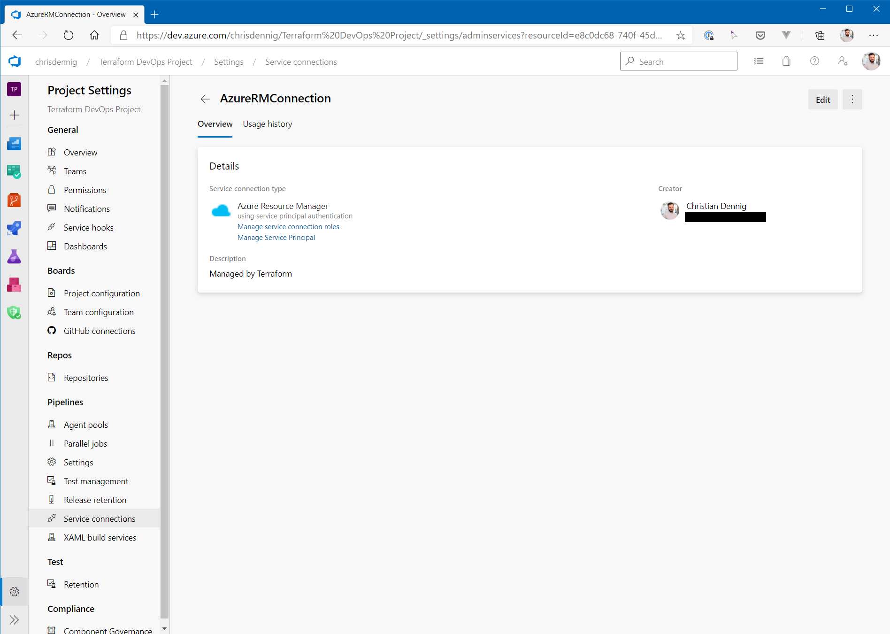

### Creation of an Azure DevOps variable group and pipeline definition

The last step necessary to use the KeyVault in a pipeline is to create a corresponding variable group and "link" the existing secret.

```hcl
## Pipeline with access to kv secret

resource "azuredevops_variable_group" "kvintegratedvargroup" {
  project_id   = azuredevops_project.project.id
  name         = "kvintegratedvargroup"
  description  = "KeyVault integrated Variable Group"
  allow_access = true

  key_vault {
    name                = azurerm_key_vault.keyvault.name
    service_endpoint_id = azuredevops_serviceendpoint_azurerm.endpointazure.id
  }

  variable {
    name    = "kvmysupersecretsecret"
  }
}
```

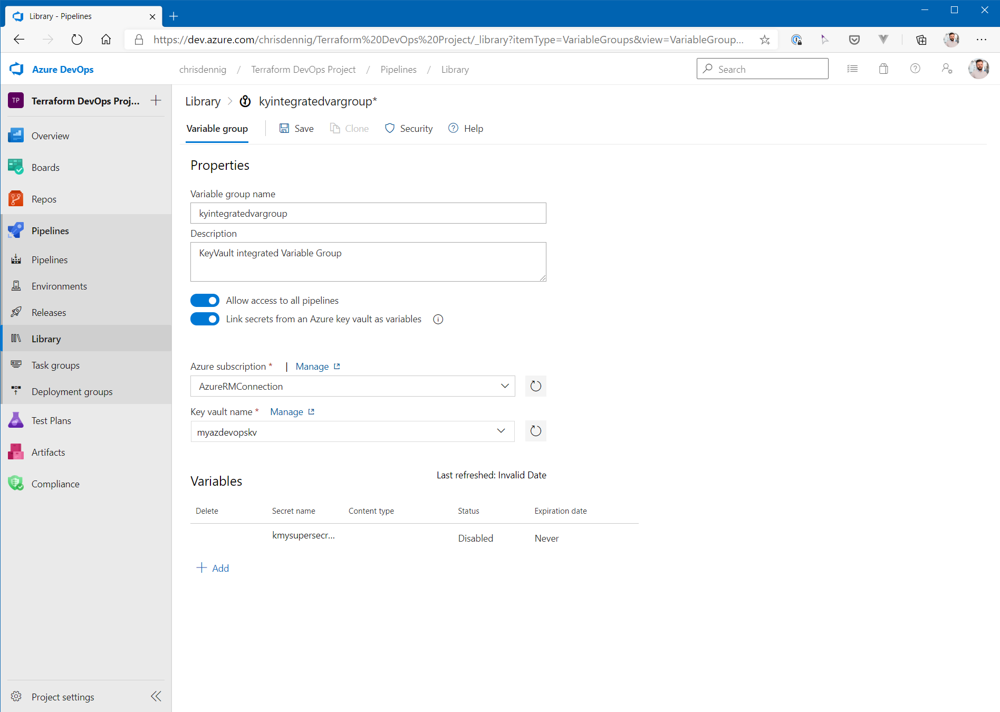

### Test Pipeline

All prerequisites are now in place, but we still need a pipeline with which we can test the scenario.

Script for the creation of the pipeline:

```hcl
resource "azuredevops_build_definition" "buildwithkeyvault" {
  project_id = azuredevops_project.project.id
  name       = "Sample Build Pipeline with KeyVault Integration"

  ci_trigger {
    use_yaml = true
  }

  variable_groups = [
    azuredevops_variable_group.kvintegratedvargroup.id
  ]

  repository {
    repo_type   = "TfsGit"
    repo_id     = azuredevops_git_repository.repo.id
    branch_name = azuredevops_git_repository.repo.default_branch
    yml_path    = "azure-pipeline-with-keyvault.yaml"
  }
}
```

Pipeline definition (```azure-pipeline-with-keyvault.yaml```):

```yaml
trigger:
- master

pool:
  vmImage: 'ubuntu-latest'

variables:
- group: kvintegratedvargroup

steps:
- script: echo Hello, world!
  displayName: 'Run a one-line script'

- script: |
    echo KeyVault secret value: $(kvmysupersecretsecret)
  displayName: 'Run a multi-line script'
```

If you have run the Terraform script and pushed the pipeline file into the repo, you will get the following result in the next build (the secret is _not_ shown in the console for security reasons, of course!):

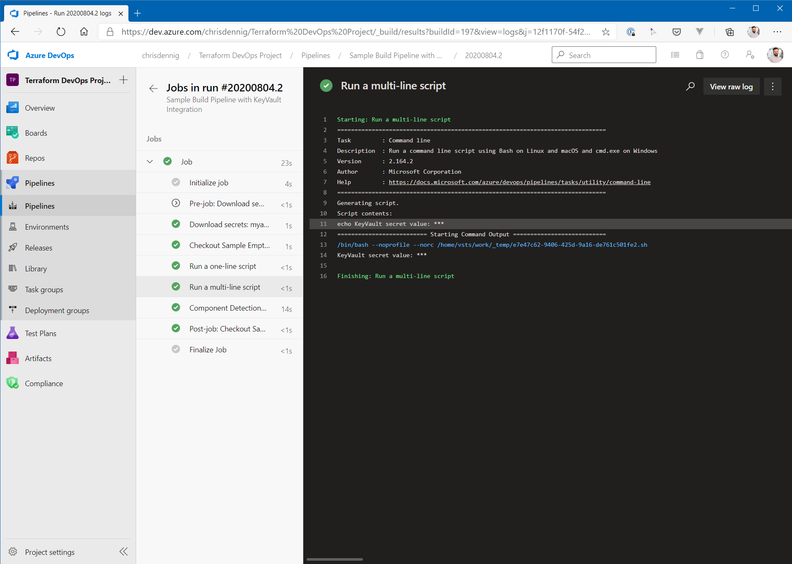

## Wrap-Up

Setting up new Azure DevOps projects was not always the easiest task, as sometimes manual steps were required. With the release of the first Terraform provider version for Azure DevOps, this has changed almost dramatically :) You can now - as one of the last building blocks for automation in a dev project - create many things via Terraform. In the example shown here, the access to an Azure KeyVault including the creation of the service connection could be achieved. However, only one module was shown here - frankly, one that "annoyed" me every now and then, as most of it had to be set up manually. What hasn't been shown: the provider can also manage branch policies, set up groups and group memberships etc. With this first release you are still "at the beginning of the journey", but in my opinion, it is a good start with which you can achieve a lot.
